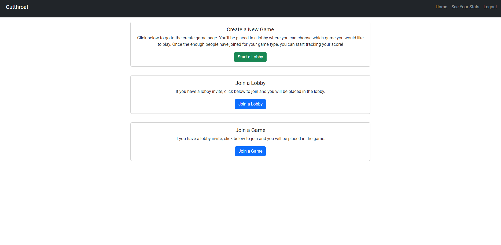
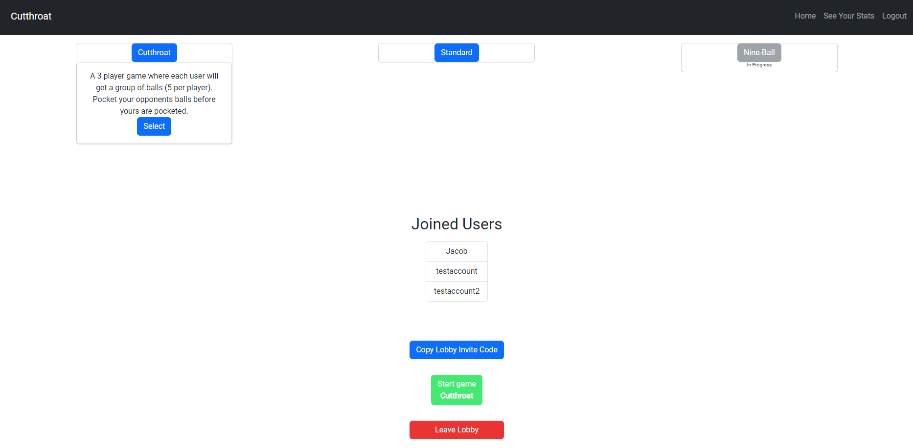
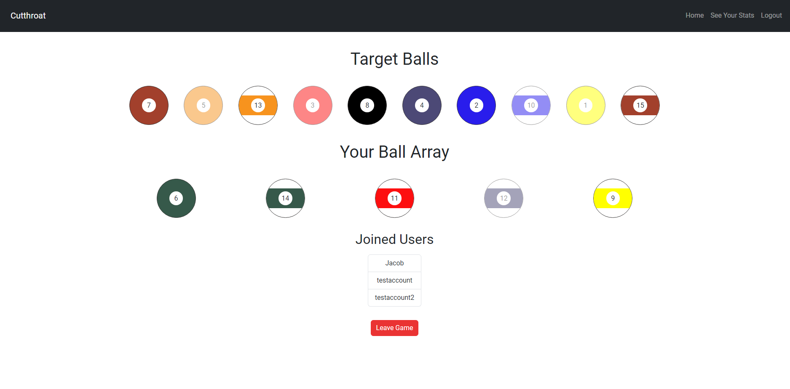

# Billiard-Game-Tracker

## Description

This application is made with the intentions of keeping track of a player's performance while they are playing a game of billiards. Users are able to create a lobby and select a gametype to play with their partners (currently supports standard and cutthroat gametypes). If the correct amount of users are in the lobby for the selected gametype, the game will be available to start. While in the game, the user can click/tap on the pool balls in their array to keep track of what balls have been pocketed or not. After the game concludes, the user can review some basic statistics of their previous matches.

## Table of Contents
[Install][#install]
[Overview][#overview]
[Screenshots][#screenshots]
[Links][#links]

## Install
To run the application locally:
1. Clone the repository from: git@github.com:JacobYaws/Billiard-Game-Tracker.git
2. Install dependencies in the app root directory through a git CLI: 'npm install'
3. Run 'npm start' in the git CLI

## Overview

- This app is a MERN application. GraphQL and Apollo are used for making database changes from the front-end.
- This application is setup as a multiplayer game so the lobby and game pages will respond to changes made by other users (i.e. Users leaving or joining a game or lobby will have their status accurately represented to the other users, if one user starts a game from the lobby, the other user(s) will automatically be put in the created game, gametypes that show a target ball array will have the ball statuses change as the other users update their selection).

## Screenshots

## Links

-Github: https://github.com/JacobYaws/Billiard-Game-Tracker

-Deployed Site: https://aqueous-temple-76852-cd9ac3be41de.herokuapp.com

